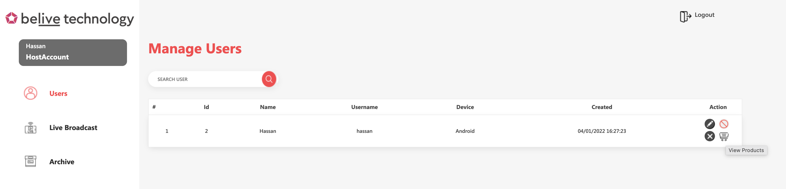
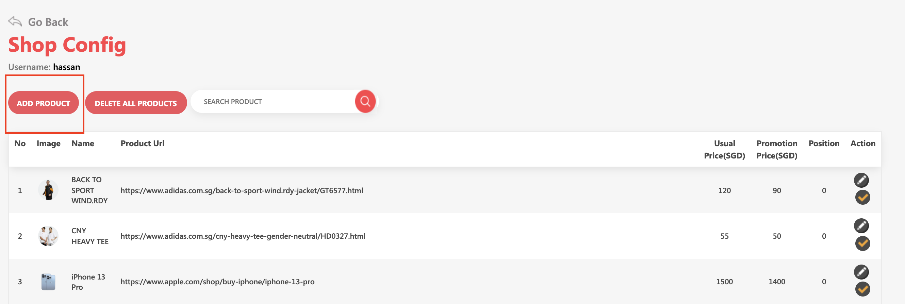
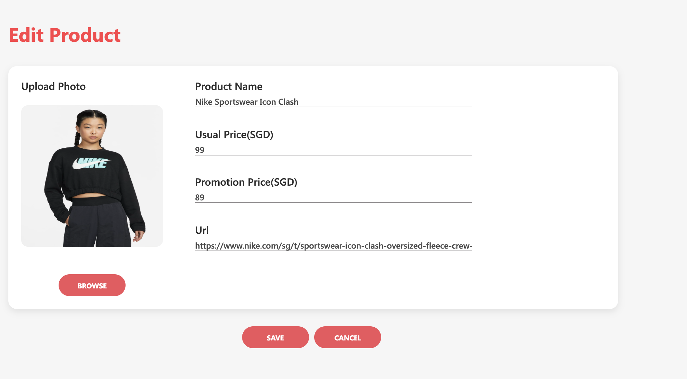
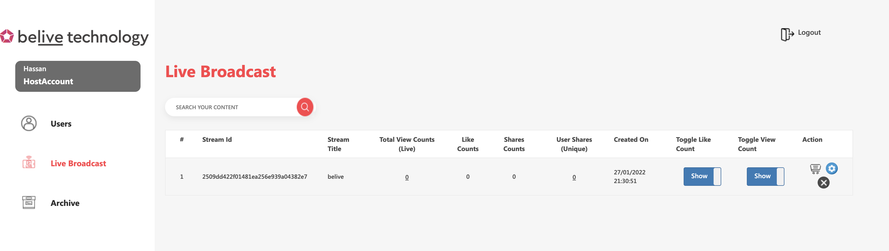
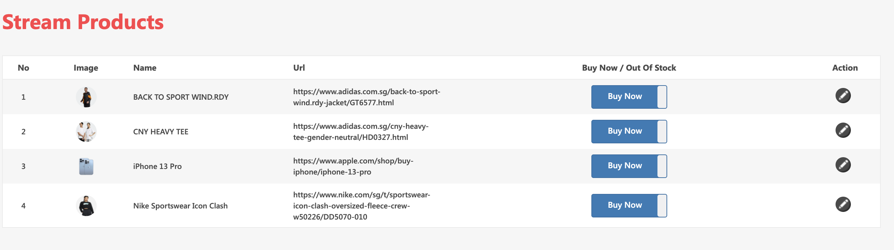
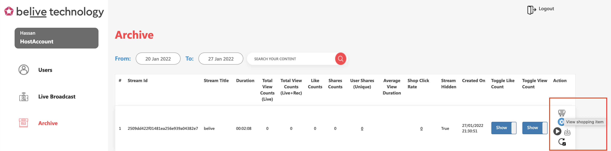

Live shopping products can be configured in following two ways

* Content Management System (CMS)
* Upload and managed products using iOS and Android SDK API (Refer to respective guides)

Live shopping products for live and recorded streams can be obtained using SDK API.

* Fetch products during live and recorded stream viewing using Web, iOS and Android SDK API (Refer to respective guides)

Find below comprehensive guide for CMS.

## CMS Guide&#x20;

### Setting up products

1. Login to CMS using provided credentials
2. Click on Users in the left navigation.
3. Click on the shopping cart button to add / edit / deactivate products.
4. Verify all the products, before the host can go live. All active products will be exported to live stream. For product images, we recommend size of `400x400 pixels`

Click Shopping cart button on right

Click on Add product to add new product or edit existing products 

Fill in all the required information and click save. In case of no promotion price, just enter 0

Verify activated products and Go Live!

### Manage products during live broadcast

Go to Live Broadcast section in left menu. Click on shopping cart next to live stream. You can edit product information during live stream. After editing product, click on save. You can also mark product to be out of stock during live. It will be reflected on both host / broadcaster and Viewer side using SDK API.

Live Broadcast section

Edit stream products during live stream and then press save

### Manage products of archived stream

Go to Archive section on left menu of CMS. Click on shopping cart next to archived stream. You can edit product information for archived streams

Archived streams

[Edit stream products in archived streams and click save

