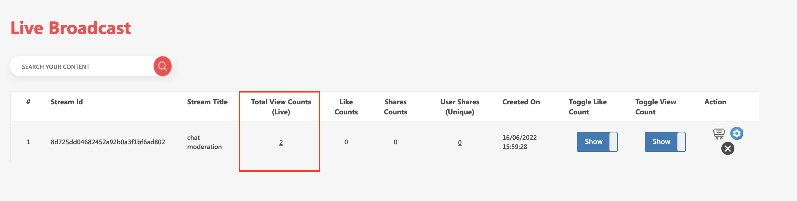
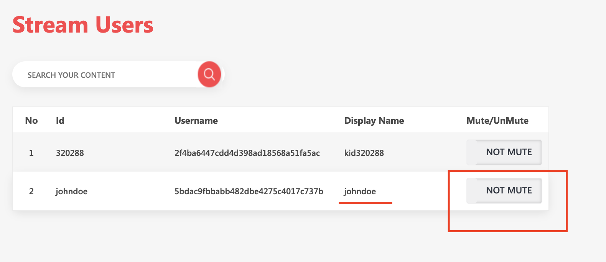
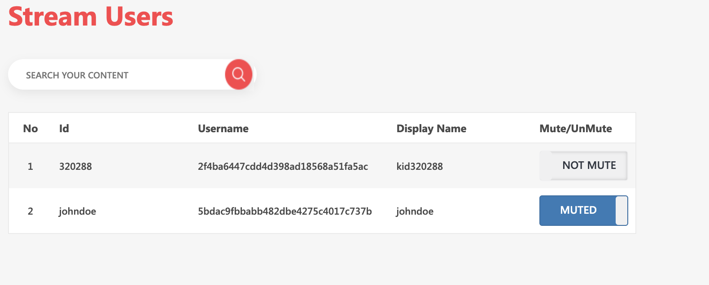
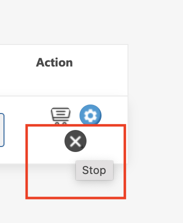

Live Shopping CMS provides ability to mute users from commenting during live stream. To access this feature, follow below mentioned steps

### Mute user

1. Login to CMS using provided credentials
2. Click on Live Broadcast in the left navigation.
3. Enter the Stream Users section by clicking on number under Total View Count (Live) column.

4. Click on `Not Mute` to Mute user. 

5. You will see that status of user will change to `MUTED`. Respective iOS, Android and Web SDKs will get Callback/Events for this case. See more information in [Moderation API](moderation-sdk-api.html#muteun-mute-users-from-commenting-during-live-stream)

### Stop Stream

Live Shopping CMS also provides ability to stop live stream from CMS. To access this feature, follow below mentioned steps

1. Login to CMS using provided credentials
2. Click on Live Broadcast in the left navigation.
3. Click on Stop Stream button under `Actions` column. Respective iOS and Android SDKs will get end Stream Callback/Events for this case
